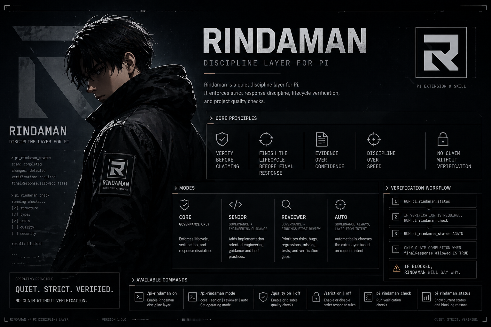

# pi-rindaman

Pi verification package and local CLI for strict response discipline, lifecycle verification, and project quality checks.



## Purpose

`pi-rindaman` is a **verification layer**, not a workflow framework.

It owns:
- strict response discipline
- verification-before-completion behavior
- project quality checks through the bundled CLI
- final-response gating based on recorded verification state

It does **not** own:
- brainstorming
- planning
- execution orchestration
- code review workflow methodology
- general developer operating-system behavior

Those concerns belong in workflow packages such as `pi-superpowers-plus`.

## Package surfaces

This repository publishes three Pi-facing surfaces:
- extension: `extensions/pi-rindaman.ts`
- skill: `skills/pi-rindaman/SKILL.md`
- CLI: `bin/pi-rindaman.cjs`

This repository no longer presents the legacy plugin runtime as a public surface.

## Quick install

```bash
pi install git:github.com/mahdyarief/pi-rindaman
```

Local checkout install also works:

```bash
pi install .
```

Project-local install also works:

```bash
pi install -l .
```

## Confirm the package was installed

Run:

```bash
pi list
```

Expected git-install output:

```text
User packages:
  git:github.com/mahdyarief/pi-rindaman
    C:\Users\Lenovo\.pi\agent\git\github.com\mahdyarief\pi-rindaman
```

Expected local-install output:

```text
User packages:
  C:\path\to\pi-rindaman
```

## Reload Pi so the package surfaces are available

- Run `/reload`, or restart Pi.

After reload, the package should expose:
- `/skill:pi-rindaman`
- `/pi-rindaman on`
- `/pi-rindaman off`
- `/strict on`
- `/strict off`
- `pi_rindaman_check`
- `pi_rindaman_status`

## Run one proof command

```text
pi_rindaman_status
```

The first proof is not “all checks pass.” The first proof is that the package is loaded and responding.

## Verification workflow in Pi

When code changed:

1. run `pi_rindaman_status`
2. if verification is required, run `pi_rindaman_check`
3. run `pi_rindaman_status` again
4. only claim done when `finalResponse.allowed` is `true`

## First-run troubleshooting

- `pi list` does not show `git:github.com/mahdyarief/pi-rindaman`: install the package again.
- `pi list` shows the package, but commands or tools are missing: run `/reload` or restart Pi.
- `pi_rindaman_status` is still unavailable after reload: verify the package path in `pi list`, then reload again.

## CLI

Run from the project root:

```bash
pi-rindaman
pi-rindaman check --json
pi-rindaman audit --json
pi-rindaman baseline --json
pi-rindaman doctor --json
```

Target an explicit repo root from another directory:

```bash
pi-rindaman check --json --project-root /path/to/project
pi-rindaman doctor --json --project-root /path/to/project
```

## Publish-ready contract

Stable public surfaces:
- CLI commands: `check`, `audit`, `baseline`, `doctor`
- Pi tools: `pi_rindaman_check`, `pi_rindaman_status`
- Pi commands: `/pi-rindaman on`, `/pi-rindaman off`, `/strict on`, `/strict off`
- verification status concepts: `verificationRequired`, `checkFreshness`, `lastCheck`, `finalResponse`

Active product docs live at:
- `docs/product-contract.md`
- `docs/releasing.md`
- `docs/README.md`

Archived overlap-era design history lives under:
- `docs/archive/overlap-era/`

Archived documents are not package API.

## Works with pi-superpowers-plus

| Concern | pi-rindaman | pi-superpowers-plus |
|---|---|---|
| Final-response discipline | Owns | May compose with |
| Verification gating | Owns | May invoke |
| CLI quality checks | Owns | May invoke |
| Brainstorming and planning | Does not own | Owns |
| Execution orchestration | Does not own | Owns |
| Workflow methodology | Does not own | Owns |

Recommended composition:
- install `pi-superpowers-plus` for planning and execution workflow
- install `pi-rindaman` for verification readiness and completion gating

## Development

```bash
npm install
npm test
npm run format:check
npm run knip
npm run typecheck
```

## Release verification

```bash
npm run release:check
```

This verifies:
- typecheck
- formatting
- unused-code scan
- tests
- package doctor
- package-wide `check --json --all`
- package-wide `audit --json --all`
- npm pack dry-run output

## Package structure

```text
pi-rindaman/
├── bin/
├── docs/
├── extensions/
│   └── pi-rindaman.ts
├── skills/
│   └── pi-rindaman/
│       └── SKILL.md
├── src/
│   ├── cli/
│   └── quality-engine/
├── test/
└── package.json
```

## Notes

- discoverable through the `pi` manifest and `pi-package` keyword
- Pi loads the extension directly from TypeScript
- the extension imports `@sinclair/typebox`, so that package is declared as a peer dependency
- `pi-rindaman` is designed to compose with `pi-superpowers-plus`, not replace it
